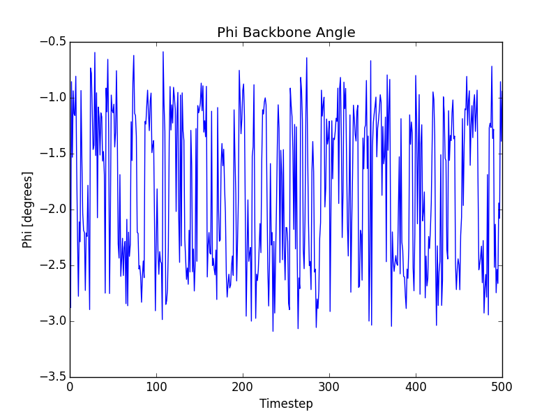

% title: Engineering a full python stack for biophysical computation
% author: Kyle A. Beauchamp
% author: Slides here: goo.gl/rKGhzZ
% favicon: figures/membrane.png

---
title: The atomistic basis of disease

...EVKMD<b>A</b>EFRHDS...  ...EVKMD<b>T</b>EFRHDS...  ...EVKMD<b>V</b>EFRHDS...

     

<footer class="source"> 
Jonsson, 2012  A673 T673 V673
</footer>

---
title: Molecular dynamics
subtitle:  Predict experiments quantitatively, rationalize function, design molecules

<video id="sampleMovie" src="movies/shaw-dasatanib-2.mov" loop=\"true\ autoPlay=\"true\  width="512" height="384"></video>

<footer class="source"> 
Movie Credit: Shan et al: J. Am. Chem. Soc. (2011).  Dasatinib / src
</footer>

---
title: Outline

- Simulating Biological Molecules: OpenMM + Folding@Home
- Inference on atomistic simulations: MSMBuilder + MDTraj
- A full stack for biophysical computation: Omnia.md
- Application: Benchmarking Small Forcefields

---
title: How do we reach biological timescales?
subtitle: The timescale gap: $10^{12}$

<footer class="source">
Church, 2011.
</footer>

---
title: Molecular dynamics is (finally) fast
subtitle: A \$999 GPU buys 128 ns / day on solvated proteins

<footer class="source"> 
GTX Titan, DHFR, OpenMM 6.2 (openmm.org) See also: Gromacs, AMBER, Charmm, NAMD, DESMOND, ACEMD
</footer>

---
title: OpenMM
subtitle: GPU accelerated molecular dynamics

- Extensible C++ library with Python wrappers
- CUDA, OpenCL, CPU

<footer class="source"> 
openmm.org  
Eastman et al, 2012.
</footer>

---
title: OpenMM powers Folding@Home

- GPUs only take us to ~100 ns / day
- Largest distributed computing project
- 10,000 GPUs, milliseconds in aggregate!

<footer class="source"> 
http://folding.stanford.edu/
</footer>

---
title: Traditional simulation analysis: movies

---
title: Massively parallel simulation?

---
title: Introduction to Markov state models

<footer class="source"> 
See work by Chodera, Bowman, Beauchamp, Pande, Noe, Huang, Voelz, Hummer, Prinz, Singhal
</footer>

---
title: Application: millisecond protein folding

<footer class="source"> 
Voelz, Bowman, Beauchamp, Pande. J. Am. Chem. Soc., 2010

Beauchamp, et al, JCTC 2011

Beauchamp, et al, PNAS 2011

Beauchamp, et al, PNAS 2012
</footer>

---
title: Application: chemotherapy resistance

<footer class="source"> 
cbioportal.org
</footer>

---
title: MSMBuilder
subtitle: Finding meaning in massive simulation datasets

<footer class="source"> 
msmbuilder.org  

Bowman et al, 2009.

Beauchamp et al, 2012. 
</footer>

---
title: MSMBuilder3: design

Builds on [scikit-learn](http://scikit-learn.org/stable/) idioms:

- Everything is a `Model`.
- Models are `fit()` on data.
- Models learn `attributes_`.
- `Pipeline()` concatenate models.

<footer class="source"> 
http://rmcgibbo.org/posts/whats-new-in-msmbuilder3/
</footer>

---
title: MSMBuilder3: demo

<pre class="prettyprint" data-lang="python">
from msmbuilder import example_datasets, cluster, msm
from sklearn.pipeline import make_pipeline

dataset = example_datasets.alanine_dipeptide.fetch_alanine_dipeptide()  # From Figshare!
trajectories = dataset["trajectories"]  # List of MDTraj Trajectory Objects

clusterer = cluster.KCenters(n_clusters=10, metric="rmsd")
msm_model = msm.MarkovStateModel()

pipeline = make_pipeline(clusterer, msm_model)
pipeline.fit(trajectories)

</pre>

<footer class="source"> 
msmbuilder.org  
</footer>

---
title: MDTraj: trajectory IO and featurization

- Multitude of formats (PDB, DCD, XTC, HDF, CDF, mol2)
- Geometric trajectory analysis (distances, angles, RMSD)
- Numpy / SSE kernels enable Folding@Home scale analysis

 

<pre class="prettyprint" data-lang="python">

import mdtraj as md

trajectory = md.load("./trajectory.h5")

indices, phi = md.compute_phi(trajectory)

</pre>

<footer class="source"> 
mdtraj.org

McGibbon et al, 2014.

Haque, 2014.
</footer>

---
title: A full stack for biophysical computation

<pre>
conda config --add channels http://conda.binstar.org/omnia
conda install omnia
</pre>

- OpenMM 6.2
- MDTraj 1.3
- MSMBuilder 3.0
- Yank 1.0 (beta)
- pymbar 2.1
- EMMA

<footer class="source"> 
omnia.md
</footer>

---
title: Benchmarking small molecule forcefields at the scale of NIST

- Small molecule forcefields need work

<footer class="source"> 
Fennell, Mobley.  J. Phys. Chem. B. 2014
</footer>

---
title: Data access is killing forcefields

- Thousands of parameters = thousands of measurements
- Most datasets are heterogeneous, offline, and static

---
title: Data capture at NIST/TRC: ThermoML

---
title: ThermoML is rapidly growing

<footer class="source"> 
Figure from Chiraco, J. Chem. Eng. Dat., 2013.
</footer>

---
title: Falsifying forcefields using neat liquid density and dielectric constants

- Sensitive to nonbonded parameters
- Simple ensemble average geometric interpretation

$$\rho = \langle \frac{M}{V} \rangle$$

$$\epsilon = 1 + \frac{4\pi}{3} \frac{\langle \mu \cdot \mu \rangle - \langle \mu \rangle \cdot \langle \mu \rangle}{V k_B T}$$

<footer class="source"> 
See also van der Spoel, JCTC, 2011 and Fennell, 2012.
</footer>

---
title:  Densities are in the ballpark

<footer class="source"> 
Beauchamp et al, In Preparation.
</footer>

---
title:  Static dielectric constants are consistently underestimated

<footer class="source"> 
Beauchamp et al, In Preparation.
</footer>

---
title: Fixed charges fail to capture polarizability
subtitle: Observed: $\epsilon \approx 2.0$, Predicted: $\epsilon \approx 1.0$, $\Delta \Delta G_{solv} \approx$ 2 kcal / mol

---
title: Atom counting predicts molecular polarizability to within 2%

$$\alpha = 1.53 n_C + 0.17 n_H + 0.57 n_O + 1.05 n_N + 2.99 n_S + \\ 2.48 n_P + 0.22 n_F + 2.16 n_{Cl} + 0.32 $$

$$\epsilon_{corrected} = \epsilon_{MD} + 4 \pi N  \frac{\alpha}{\langle V \rangle}$$

<footer class="source"> 
Sales, 2002
</footer>
---
title: Empirical atomic polarizability corrections reduce bias

<footer class="source"> 
Beauchamp et al, In Preparation.
</footer>

---
title: Where do we go from here?

- Scale up, real-time simulation, CI, web frontend
- Perform new experiments in automated wetlab
- Bayesian (MCMC) forcefield / experimental design

---
title: Bayesian Energy Landscape Tilting

- Infer conformational ensembles from simulation <b>and</b> ambiguous experiments
- Characterize posterior through MCMC
- Error bars on equilibrium <b>and</b> structural features

    

<footer class="source"> 
Beauchamp, Pande, Das.  Biophys. J.  2014.
</footer>

---
title: Takeaways

- Distributed GPU computing enables millisecond simulation
- MSMBuilder / MDTraj builds machine learning models of conformational dynamics
- omnia.md: Conda packaging of OpenMM, MSMBuilder, MDTraj, and more
- ThermoML: towards automated benchmarking of atomistic models

---
title: People

- John Chodera + ChoderaLab (MSKCC)
- Julie Behr (MSKCC)
- Kenneth Kroenlein (NIST)
- Robert McGibbon (Stanford)
- Peter Eastman (Stanford)
- Vijay Pande + PandeLab (Stanford)
- Joy Ku (Stanford)
- Jason Swails (Rutgers)
- Justin MacCallum (U. Calgary)

<footer class="source"> 
Jan-Hendrik Prinz, Danny Parton, Bas Rustenburg, Sonya Hanson
Greg Bowman, Christian Schwantes, TJ Lane, Vince Voelz, Imran Haque, Matthew Harrigan, Carlos Hernandez, Bharath Ramsundar, Lee-Ping Wang
Frank Noe, Martin Scherer, Xuhui Huang, Sergio Bacallado, Mark Friedrichs
</footer>
